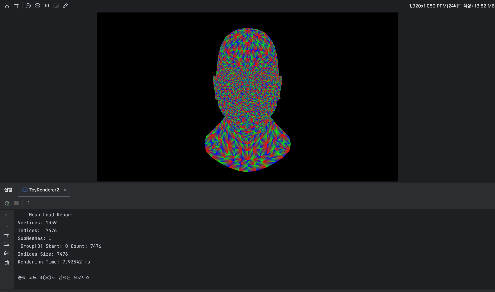
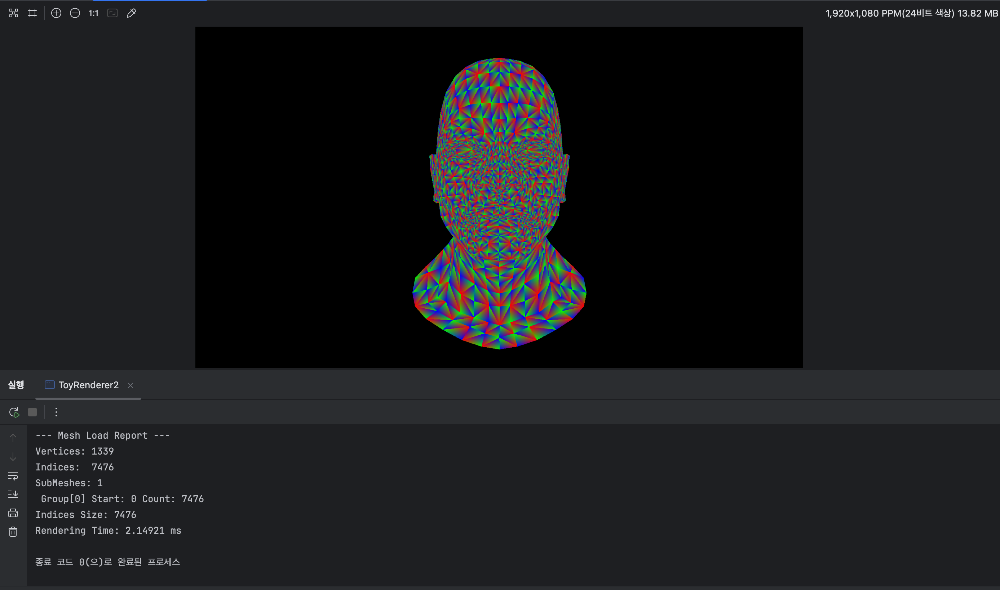

# 번외) 5.5일차 - 병렬화

--- 

최근 운영체제 강의를 듣고 있어서 멀티스레드 프로그래밍 예제를 볼 일이 많아졌다.  
실제 렌더러는 GPU를 통한 병렬 처리를 하지만 이 프로젝트는 그런게 없기 때문에 모든 연산을 직렬로 하고 있다.  
지루한 시험 공부 중 문득 "OpenMP 정도는 1줄이면 끝나니까 넣을 수 있지 않을까?" 하는 생각을 하게 됐다.  
대충 나의 생각 흐름은 다음과 같다.  
```markdown
공부 하기 싫음 → 실전에서 병렬 프로그래밍 해봄 → 어떻게 보면 이것도 공부 → 시험공부 안할 수 있음
```
그래서 결국 여기에 OpenMP를 넣어보기로 했다.  

---
# Renderer.h

### `drawModel()`  
드로우 모델 친구를 병렬화 하면 딱이다.  
삼각형 하나를 만들어서 깊이 버퍼 체크하고 그리고 다시 쓰고 하는게 딱 봐도 병렬화하기 좋아보인다.
```c++
#pragma omp parallel for
```
for 문 위에 이거 한 줄을 넣어두면 반복문이 여러 스레드에서 나눠서 실행된다.  
그럼 이제 이걸 직접 달아보자. 
```c++
inline void DrawModel(Canvas &canvas, const Mesh &mesh, const VertexShader &vertexShader) {
    
    // 대충 잡다한 계산들

    #pragma omp parallel for
    for (size_t i = 0; i < mesh.indices.size(); i+=3) {
        TFVertex tri[3];
        for (size_t j = 0; j < 3; j++) {
            const uint32_t vertexIndex = mesh.indices[i + j];
            const Vertex& v = mesh.vertices[vertexIndex];

            tri[j] = vertexShader.vertexShader(v);

            const float invW = tri[j].invW;
            tri[j].position.x = (tri[j].position.x * invW + 1.0f) * 0.5f * static_cast<float>(w);
            tri[j].position.y = (1.0f - tri[j].position.y * invW) * 0.5f * static_cast<float>(h);
        }
        FillTriangle(canvas, tri);
    }
}
``` 
이렇게 달아주면 벌써 병렬화가 끝난거다.  
하지만 `FillTriangle()`의 처리 과정에 문제가 있다.  
Depth Buffer가 공유 자원이므로, Data Race가 발생할 여지가 있기 때문이다.  
예를 들어 다음과 같은 시나리오를 생각할 수 있다.

1. 스레드 T1과 T2가 같은 위치의 픽셀을 그리고자 함.
2. T1과 T2가 동시에 Depth Buffer를 읽어 z좌표를 4이라고 읽음.
3. 4(방금 읽은 depthBuffer값) > 2(T1이 그리려는 픽셀)이므로,   
T1이 z좌표가 2인 픽셀을 그리고 depth buffer에 2를 기록함.
4.  4(방금 읽은 depthBuffer값) > 3(T1이 그리려는 픽셀)이므로,  
 T2가 z좌표가 3인 픽셀을 그리고 depth buffer에 3을 기록함.
5. 결과적으로 z=2인 T1의 픽셀만이 화면에 남아야 하지만,  
더 나중에 그려진 z=3인 T2의 픽셀만이 화면에 남는다. 

이 시나리오대로라면 검사가 현재 픽셀의 상태를 온전하게 반영하지 못하므로,  
픽셀의 z좌표 상으로 더 뒤쪽에 픽셀만 그려지는 상황이 발생할 수 있다.  

물론 여러 번 테스트 한 결과 두 스레드가 동시에 같은 위치의 픽셀을 그리는 일 자체가 흔치 않은지  
문제가 되는 상황이 발생한 적은 없었다.  
하지만 위험이 있는데 안 고치는건 그것대로 찝찝하므로 depth비교 + 갱신을 한 번의 처리할 방법을 찾아보았다. 
```c++
void FillTriangle(Canvas& canvas, const span<const TFVertex, 3> pts) {
    
    // 삼각형이 있을범한 범위 계산

    // 삼각형 선언하기
    
    for (int i = yStart; i <= yEnd; i++) {
        for (int j = xStart; j <= xEnd; j++) {
            //barycentric 좌표 계산하고 픽셀이 삼각형 안에 있는지 체크

            std::atomic_ref<float> target_depth(canvas.depthBuffer[idx]);

            float old_depth = target_depth.load(memory_order_relaxed);
            while (depth <= old_depth) {
                if (target_depth.compare_exchange_weak(
                    old_depth, depth, memory_order_release, memory_order_relaxed)) {
                    const Vec3 color = {bary.x, bary.y, bary.z}; // 임시값 그라데이션
                    // color = 프레그먼트 셰이더 호출
                    canvas.setPixel(j, i, color);
                    break;
                }
            }
        }
    }
}
```
수정한 코드는 이런식으로 나왔다. 
먼저, `depthBuffer`를 `atomic_ref`로 선언해주었다.  
이러면 여러 스레드가 `depthBuffer`에 한 번에 접근해도 데이터의 원자성이 보장된다.  
그 뒤, `load()`를 써서 `old_depth`를 정의해준다. `load()`를 사용하면 버퍼의 데이터를 읽어와 변수에 저장한다.  
`=`으로 대입하는 것 과의 차이를 말하자면, 일반적인 접근은 여러 스래드가 동시에 읽고 쓸 때 최신값이 보장되지 않을 수 있다.  
반면 `load()`를 사용하면 호출 시점의 가장 최신의 데이터를 안전하게 가져온다.  

이후 `compare_exchange_weak()`를 통해 z값을 바꿔주고, 픽셀을 칠하게 된다.  
`compare_exchange_weak()`는 첫 번쨰 인자의 값과 메모리 상의 살제 값이 일치할 경우 값을 두 번쨰 인자로 갈아끼운다고 한다.  
만약 첫 번쨰 인자의 값이 실제 값과 다르다면 실제 값을 첫 번쨰 인자인 `old_depth`변수에 집어넣고 `false`를 리턴한다.  
그러면 `whlie()`루프에 의해 다시 비교 후 쓰기 시도를 한다.  
다시 말해 동시성이나 CPU 스케줄링에 의해 아까 읽어온 값과, 실제 캐시의 값이 달라지면 값을 억지로 쓰지 않고 최신 데이터를 재확인하는 것이다.  
이런 패턴을 CAS라고 부른다고 한다.

설명이 길어졌는데 사실 필자 본인도 완벽하게 아는 내용이 아니고, 병렬 프로그래밍을 공부한다면 더 다르게 될 내용이므로,   
이해가 안 된다면 흐름 정도만 체크하고 넘어가도 좋다고 생각한다.
---
# 테스트
```c++
inline void DrawModel(Canvas &canvas, const Mesh &mesh, const VertexShader &vertexShader) {
    std::cout << "Indices Size: " << mesh.indices.size() << std::endl;

    auto start = std::chrono::high_resolution_clock::now();

    // 캔버스 크기 구하기
    #pragma omp parallel for
    for (size_t i = 0; i < mesh.indices.size(); i+=3) {
        //삼각형 조립 + 픽셀 칠하기
    }

    auto end = std::chrono::high_resolution_clock::now();
    std::chrono::duration<double, std::milli> elapsed = end - start;
    std::cout << "Rendering Time: " << elapsed.count() << " ms" << std::endl;
}
```
위처럼 `chrono`헤더를 사용하여 렌터더링 타임을 측정해 보았다.

위 이미지의 테스트는 M4 맥북 에어 16GB메모리 환경에서 진행되었다.  
단일 코어 환경에서는 `African_head.obj`모델의 7476개의 면을 래스터라이징 하였다.  
총 7.93542ms가 소요되었다.

이후, 멀티코어 환경에서 테스트를 진행해 보았다. M4 칩은 성능 코어 4개, 효율 코어 6개를 사용하는 Heterogeneous Parallel System이다.  
Amdahl's law에 의해 최대 10배 까지 빨라질 수 있고,  
`DrawModel()`에서 직렬화된 부분은 `canvas`객체로부터 크기를 가져오는 부분이 전부이기 때문에 시간이 어떻게 나올지 상당히 기대된다.


테스트 결과 7476개의 면을 래스터라이징 하는데에 2.14921ms가 소요되었다.  
아니 암달이 어쩌구 10개의 코어가 어째? 잘 쳐 줘야 1/4정도의 시간이 나왔다.  
아니 어차피 10배 빨라지는 이론상의 최고점이니까 안되는거 당연히 알고 있는데 이건 좀 많이 실망스러운 값이다.  
기분 잡쳤으니 오늘 일지는 여기서 끝이다.  

--- 
# 후기  
살면서 처음으로 `omp`라는걸 써봤는데 병렬 처리를 알아서 해준다는게 진짜 편하긴 한것 같다.  
이거 일지 쓰기 시작할 때는 시험기간이었는데 지금은 시험 끝나고 이렇게 쓰고 있다. .5일차 라고 붙일게 아니었나보다.  
생각보다 분량이 많은건지 시험 망친 슬픔 때문에 전에 짜둔 코드가 기억이 안 나는지 모르겠지만 일지 쓰는게 오늘따라 꽤나 어려웠다.  
일지는 5.5일차까지 있는데 이 프로젝트 생성한 날짜는 38일 전이다. 나의 시간은 7배 천천히 가나보다.  
생각해보면 38일동안 순수 작업량은 5.5일밖에 안되는 거다. 다음 기능은 좀 빨리빨리 추가해야겠다.
