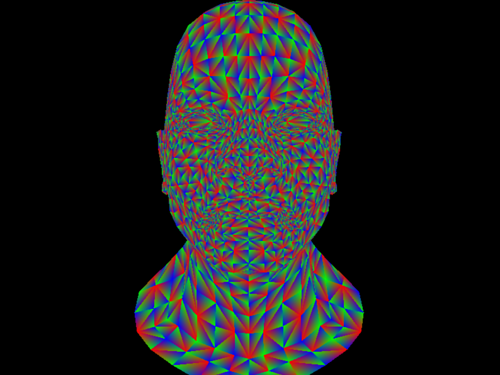

# 5일차 - Depth Buffer & Renderer

---
드디어 테스트라는걸 돌려 볼 시간이 된 것 같다.  
이번엔 모델의 Z값을 저장해서 카메라쪽에서 보이는 면만 그릴 수 있도록 도와주는 Depth Buffer와  
파이프라인을 연결해서 한 번에 모델을 그주는 `DrawModel()`을 만들어 보았다.  
지난 4일차 개발 일지에 "테스트 안 돌아가면 정신병원 입원하겠다." 라고 적었었는데 떡밥 회수를 해버렸다.  
진짜 입원은 안했겠지만 테스트 안돌아가서 한참을 디버깅 하고 나서야 렌더링에 성공했다.  
물론 아직 프레그먼트 셰이더가 없어서 폴리곤 하나하나를 4일차에 만들었던 무지개 그라데이션 삼각형으로 색칠했다.

# Depth Buffer
모델을 그림으로 그릴 떄 앞에 있는 면과 뒤에 있는 면을 섞이지 않게 하는 방법을 생각해보자.  
가장 naive한 방법으로는 픽셀을 깊이 기준으로 정렬하여 멀리 있는 면 부터 앞으로 그리는 방법을 생각할 수 있다.  
멀리 있는 면 부터 앞쪽으로 덮어쓰기 하면서 그리기 때문에 가려진 면이 카메라에 보이지 않게 그릴 수 있다.  
하지만 정렬 비용이 추가적으로 발생한다는 점, 어차피 보이지 않을 점 까지 그러진다는 점에 비용이 너무 커진다.  

그래서 렌더러에서는 픽셀마다 깊이값을 아예 'Depth Buffer' 또는 'Z-Buffer' 라는 이름의 변수로 저장해두는 방법을 사용한다.  
픽셀을 그리기 전 이 Depth Buffer를 읽고, 기존의 깊이값과 현재의 깊이값을 비교해서 보이는 픽셀만 그리겠다는 아이디어다.  
이 방법을 사용하면 픽셀을 찍기 전 비교 조건이 하나 늘어나면서 앞의 방법 대비 비교 비용은 늘어나겠지만,  
픽셀 정렬을 할 필요가 없으며, 이미 가려진 면은 프레그먼트 셰이더 자체를 호출하지 않기 떄문에 셰이더가 무거울수록 더 비용을 아낄 수 있다.


## Canvas.h

```c++
struct Canvas { 
    const int width = 0, height = 0;
    std::vector<Vec3> pixels;
    std::vector<float> depthBuffer;

    Canvas(const int w, const int h) : width(w), height(h) {
        pixels.resize(width * height);
        depthBuffer = std::vector<float>(width * height, std::numeric_limits<float>::max());
    }
}
```
일단 캔버스에 한 짓은 별거 없다. 일단 멤버 변수로 `depthBuffer`를 추가해주었다.  
이 친구는 `pixels`와 길이가 같은 배열인데 픽셀 하나하나마다 Z값을 저장해주기 위함이다.  
사실 크기도 같아서 `color`를 `Vec4` 타입으로 바꿔서 w값으로 깊이를 주면 깔끔할거 같은데 지금까지 한거 갈아엎기 귀찮아서 이렇게 했다.  
따라서 생성자에서도 `pixels`처럼 `width * height`로 초기화 해주면 된다.  
여기서 초깃값을 `float`가 가질 수 있는 최댓값을 줬는데 이 이유는 depth 처리는 숫자가 작을수록 카메라에 가까우며,  
`depthBuffer`의 기본값은 이 캔버스의 배경, 즉 모든 픽셀보다 뒤쪽에 있어야 하기 떄문이다.  

```c++
void setPixel(const int x, const int y, const float depth, const Vec3 color) {
    if (!(x >= 0 && x < width && y >= 0 && y < height)) return;
    const int idx = width * y + x;
    pixels[idx] = color;
    depthBuffer[idx] = depth;
}
```
`setPixel`도 조금 바꿔준다. 픽셀을 그릴 때 마다 뎁스값을 받아서 텝스버퍼에 기록하는 역할이다.  
원래는 Rasterizer에서 직접 쓰게 하려고 했지만 어차피 캔버스와 뎁스버퍼는 항상 동기화 되어있어야 하므로   
하나의 함수 안에서 한번에 해결하는게 나중에 헷갈리지 않는 방법이라고 생각했다.

## Rasterizer.cpp
```c++
void FillTriangle(Canvas& canvas, const span<const TFVertex, 3> pts) {
    // 삼각형에 외접하는 사각형 구하기

    // 삼각형의 세 점을 배열에 담기

    for (int i = yStart; i <= yEnd; i++) {
        for (int j = xStart; j <= xEnd; j++) {
            // bary = 바리센트릭 좌표로 변환

            // ↓ depth 계산
            const float depth = pts[0].position.z * bary.x + pts[1].position.z * bary.y + pts[2].position.z * bary.z;
            // ↓ 점을 그릴지 말지 체크
            if (bary.x < 0 || bary.y < 0 || bary.z < 0 || depth > canvas.depthBuffer[i * w + j]) continue;

            // color = 프레그먼트 셰이더 호출
            
            canvas.setPixel(j, i, dpeth, color);
        }
    }
}
``` 
이제 `FillTriangle`을 건들여서 `depthBuffer`를 사용하게 해야한다.  
바리센트릭 계산 이후 z값을 계산해서 저장하는 변수 `depth`를 만들어 주었고,  
`if`문으로 점을 찍을지 말지 체크하는 부분에 `detpth`가 기존의 깊이보다 큰 경우를 필터링하는 조건을 추가해 주었다. 

# Renderer

이제 지금까지 고생해서 만든 클래스들을 합쳐보기로 했다.  
아직 재료들이 다 완성된건 아니긴 한데 그래도 지금 단계에서 부품들이 돌아가긴 하는지 테스트가 필요해 보였다.  
```markdown
obj → Mesh → VertexShader → Rasterizer → FragmentShader → ppm  
                        mtl → Material ↗
                     png/tga → Texture ↗
```
대충 이 순서로 조립을 해 보려고 한다. 여기서 우리가 구현한 재료들은 다음과 같다.  
`Mesh`, `VertexShader`, `Rasterizer`  
위쪽 구조도에서 보면 맨 위 obj부터 시작해서 `FragmentShader`에 들어가기 전 까지의 과정이 가능하다.  
안되는건 나중에 만들고 지금 되는곳 까지만 조립해보자. 
`FragmentShader`는 픽셀의 밝리를 계산해서 색칠해주는 단계인데 어차피 지금의 코드 상으로 `Rasterizer` 내부에서 호출하고 있으니  
없어도 `FillTriangle()`안에서 색깔 임시값만 주면 모양이 잘 잡히는지 정도는 관찰 가능하다.  

## Renderer.h

### `DrawModel()`  

이제 본격적으로 조립의 시간이다.
```c++
inline void DrawModel(Canvas &canvas, const Mesh &mesh, const VertexShader &vertexShader) {
    for (size_t i = 0; i < mesh.indices.size(); i+=3) { // 폴리곤의 수 만큼 순회
        TFVertex tri[3];
        for (size_t j = 0; j < 3; j++) { // indices에서 삼각형의 점 3개 빼오기      
            // ↓ VertexShader.vertexShader() 호출해서 그 점을 원하는 모양으로 변환
            tri[j] = vertexShader.vertexShader(v);
            
            /* 아래는 화면 안에 모델 위치 맞추기!
             * FragmentShader()에서 여기로 옮겨옴
             */
            const float invW = tri[j].invW;
            tri[j].position.x = (tri[j].position.x * invW + 1.0f) * 0.5f * static_cast<float>(w);
            tri[j].position.y = (1.0f - tri[j].position.y * invW) * 0.5f * static_cast<float>(h);
        }
        // ↓ 캔버스에 그 삼각형 그리기
        FillTriangle(canvas, tri);
    }
}
```
일단 그림을 그릴 `Canvas`, 그릴 모델인 `Mesh`, 그리고 `VertexShader` 객체를 받는다.  
이후 차례되로 `Mesh`에서 폴리곤들을 가져와 `VertexShader`를 호출해서 점 변환시키고  
그거대로 `FillTriangle()`돌려서 폴리곤들을 그리는 식이다.  
딱히 무슨 로직이 있는게 아니라 입력받은 데이터대로 하나씩 호출만 하는거라 이 정도만 설명해도 될 것 같다.  

# Linear Transformation

모델과 카메라의 각도 돌리기와 평행이동을 구현하기 위해 `Geometry.h`에 함수 몇개를 만들어뒀다. 

### `translate()`
```c++
static void translate(Mat44& model, const float x, const float y, const float z) {
    model[0][3] += x;
    model[1][3] += y;
    model[2][3] += z;
}
```
대충 이렇게 구현했다. 새 값을 리턴할지, 그냥 call by reference할까 고민하다가 그냥 call by reference로 했다.  
이유는 딱히 없고 그냥 호출할 때 다시 대입하기 귀찮으니까? 근데 생각해 보니까.  
똑같은 행렬 2개 만들어서 1개만 변환 할 떄 복사하고 호출하고 하기 귀찮을거 같기도 하고.  
모르겠다 그냥 나중에 불편하면 바꾸면 되지.

### `rotate()`  
```c++
static void rotate(Mat44& model, const float x, float y, float z) {
    auto rotX = Mat44();
    const float sx = std::sin(x);
    const float cx = std::cos(x);
    rotX[1][1] = cx;
    rotX[1][2] = -sx;
    rotX[2][1] = sx;
    rotX[2][2] = cx;

    auto rotY = Mat44();
    const float sy = std::sin(y);
    const float cy = std::cos(y);
    rotY[0][0] = cy;
    rotY[0][2] = sy;
    rotY[2][0] = -sy;
    rotY[2][2] = cy;

    auto rotZ = Mat44();
    const float sz = std::sin(z);
    const float cz = std::cos(z);
    rotZ[0][0] = cz;
    rotZ[0][1] = -sz;
    rotZ[1][0] = sz;
    rotZ[1][1] = cz;

    model *= rotZ *= rotY *= rotX;
}

```
얘도 그냥 회전행렬을 코드로 그대로 옮겼다. 뭐 대충 수식으로 써보자면 아래와 같이 나온다.  
X축 방향 $= \begin{bmatrix} 1& 0& 0& 0 \\ 0& \cos(\theta)& -\sin(\theta)& 0 \\ 0& \sin(\theta)& \cos(\theta)& 0 \\ 0& 0& 0& 1\end{bmatrix}$  

Y축 방향 $= \begin{bmatrix} \cos(\theta)& 0& -\sin(\theta)& 0 \\ 0& 1& 0& 0 \\ \sin(\theta)& 0& \cos(\theta)& 0 \\ 0& 0& 0& 1\end{bmatrix}$  

Z축 방향 $= \begin{bmatrix} \cos(\theta)& -\sin(\theta)& 0& 0 \\ \sin(\theta)& \cos(\theta)& 0& 0 \\ 0& 0& 1& 0 \\ 0& 0& 0& 1\end{bmatrix}$  

---

# 테스트 - 1차

여기까지 만들었으니 테스트가 가능하다.  
대충 테스트를 돌렸더니 평행이동과 회전이 전혀 되지 않았다.
왜 이러지 하고 한참동안 여기저기 로그를 찍어봤었는데 문제가 뭐였나 봤는데 세상에 내가
```c++
// Geometry.h
Vec4(const std::initializer_list<float> list) {
        auto it = list.begin();
        while (it != list.end()) {
            if (it != list.end()) x = *it++;
            if (it != list.end()) y = *it++;
            if (it != list.end()) z = *it++;
        }
    }
```
`Vec4`의 생성자를 이따위로 정의해둔거였다. 동차 좌표계를 통해 평행이동과 회전을 하는데  
w값이 항상 기본값이나 쓰레기값이 들어가니까 당연히 회전이 안되지.   
```c++
// Geometry.h
Vec4(const std::initializer_list<float> list) {
        auto it = list.begin();
        while (it != list.end()) {
            if (it != list.end()) x = *it++;
            if (it != list.end()) y = *it++;
            if (it != list.end()) z = *it++;
            if (it != list.end()) w = *it;
        }
    }
```
그래서 이제는 또 이따위로 해놓고서는 잘 바꿨다 하면서 다시 테스트를 돌렸다.  
그러니까 검정색 화면밖에 안나오더라.  
위 코드의 문제는 `while`루프로 이터레이터를 증가시키면서 마지막에는  
"배열 채웠으니까 증가 안해도 되겠지?" 라는 기적의 판단을 하는 바람에 반복이 종료가 안 돼어 다시 x 값에 삽입이 한번 더 일어난다.  
아무튼 이렇게 2시간동안 대환장 파티를 겪은 다음 2번째 테스트를 돌렸다.  

---
# 테스트 - 2차

유명한 CPU 렌더러 튜토리얼 [Tiny Renderer](https://github.com/ssloy/tinyrenderer)
에서 데모 모델로 활용하는 `African_head.obj` 라는 모델이다.  
Fragment Shader가 없어 색깔은 무지개 그라데이션 삼각형으로 했다.  
위 사전처럼 색깔이 없어 알아 볼 수는 없지만 분명히 사람의 형테를 띄고 있음을 알 수 있다. (잘 보면 눈, 코, 입 구별도 가능하다.)

---
# 후기
오늘은 지금까지 유닛 테스트를 열심히 하지 않은 벌을 받은 것 같다.  
세상에 디버깅을 한 참을 했는데 원인이 기하 라이브러리 따위였다니 허탈할 따름이다.  
그리고 이 프로젝트 하면서 느끼는게 코딩도 코딩인데 사실 글 쓰기를 되게 열심히 하게 된다.  
오늘도 회전 변환 행렬 저거 적으면서 마크다운으로 행렬 쓰는게 이렇게 귀찮고 더러울 줄은 몰랐다.  
사실 코드 보면 나오는거 중복 설명이나 마찬가지인데 괜히 쓰겠다고 하다 피로만 느끼고 간다.  
이제 완성까지 한 절반은 온거 같은데 힘내야겠다.
