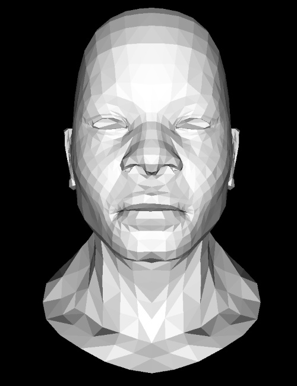
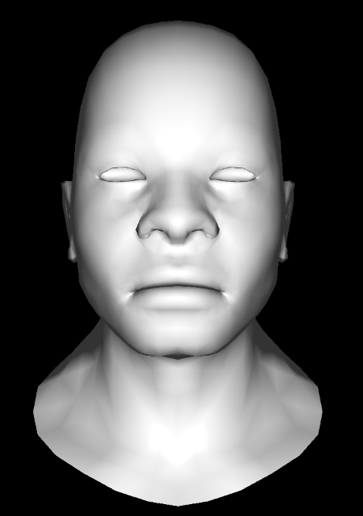
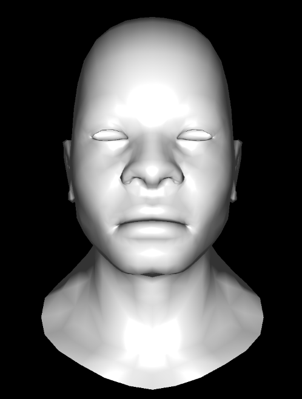

# 7일차 - Phong Shader

---

지금까지 작동 결과들은 위 이미지처럼 그래데이션 삼각형이 면을 이룬 모양이다.  
형체를 못 알아볼 정도는 아지만 자세히 보지 않으면 아프리칸헤드인지 잘 알아볼 수 없다.  
오늘은 이 삼각형 그라데이션을 없애고 광원의 위치에 맞게 제대로된 밝기를 가지게 만들겠다.  
위 설명처럼 픽셀의 밝기를 계산하는 단계의 이름을 Fragment Shading이라고 부른다.  
오늘은 몇가지 종류의 프래그먼트 셰이더를 만들어 이 아프리칸 헤드의 형상을 더 뚜렸하게 해보겠다. 
---
## FrangmentIn.h
```c++
struct alignas(16) FragmentIn {
    Vec4 normal;

    Vec4 faceNormal;

    Vec3 worldPos;
    float invW;

    Vec2 texCoord;
    std::uint32_t pad[2];
};

```
본격적으로 코드를 짜기 전에 이렇게 셰이더의 레시피(?) 비슷한 용도로 사용할 FragmentIn을 만들어주었다.  
셰이더에 필요한 데이터들을 구조체에 담아 인자로 전달받을 것이다.

## fillTriangle()
```c++
template <typename FragmentShaderType>
void fillTriangle(Canvas& canvas, const span<const TFVertex, 3> pts, FragmentShaderType& shader, Vec3 faceNormal)
```
우선 함수 시그니쳐를 위와 같이 바꿔서 템플릿을 사용하여 여러가지 셰이더를 하나의 함수로 골라 사용할 수 있도록 하였다.    
그리고 faceNormal을 추가하여 면의 법선을 받아올 것이다.

```c++
for (int i = yStart; i <= yEnd; i++) {
    for (int j = xStart; j <= xEnd; j++) {
        // 현재 픽셀을 바리센트릭을 통하여 보간
        
        FragmentIn in;
        in.worldPos = pts[0].worldPos * bary.x + pts[1].worldPos * bary.y + pts[2].worldPos * bary.z;
        in.normal = pts[0].normal * bary.x + pts[1].normal * bary.y + pts[2].normal * bary.z;
        in.texCoord = pts[0].texCoord * bary.x + pts[1].texCoord * bary.y + pts[2].texCoord * bary.z;
        in.faceNormal = faceNormal;

        // 깊이 버퍼값 비교하고 색칠
    }
}
```
그리고 픽셀 루프 안에서 FragmentIn의 값을 바리센트릭 좌표로 보간하여 넣어주는 과정을 추가하였다.

---
## Flat Shading
  
플랫 셰이더는 모델의 면의 법선을 통해 밝기를 구하고 이를 바로 칠한다.  
```c++
    Vec3 edge1 = tri[1].worldPos - tri[0].worldPos;
    Vec3 edge2 = tri[2].worldPos - tri[0].worldPos;
    Vec3 faceNormal = edge1.cross(edge2);
    if (faceNormal.z <= 0) {
        continue;
    }
```
뒷면 제거를 사용하기 위해 drawModel()에 추가한 코드의 일부이다.  
이 단계에서는 삼각형의 세 변중 2개를 외적하여 법선벡터 `faceNormal`를 계산하고 있다.    
이렇게 계산해 낸 법선 벡터 `faceNormal`은 면에 수직인 벡터이다.  
법선 벡터와 광원 벡터와 내적값은 방향이 비슷할수록 커지고, 수직일수록 작아진다.  
이 값을 밝기로 사용하겠다는 아이디어가 Flat Shading이다.

```c++
class FlatShader{
public:
    const material& mtl;
    Vec3 lightPos;

    explicit FlatShader(const material& m, const Vec3 lp, const Vec3 placeHolder) : mtl(m), lightPos(lp) {}

    Vec3 operator()(const FragmentIn& in) const {
        const Vec3 L = normalize(lightPos - in.worldPos);
        
        // 머터리얼이 없을경우의 풀백로직

        Vec3 baseColor = mtl.diffuse;
        // diffuse가 {0, 0, 0} 일 떄는 임시 값 쓰기

        const float intensity = std::max(in.faceNormal.dot(L), 0.0f);
        return baseColor * intensity + mtl.ambient * globalAmbientIntensity;
    }
private:
    const float globalAmbientIntensity = 0.5f;
};
```
기본 색상은 `mtl.diffuse`에서 가져오고, 위에서 말한 내적 원리를 통해 밝기값을 구하는 간단한 로직이다.  
`placeHolder`는 이 셰이더에서 사용하지 않는 값이지만 다른 셰이더들 에서 다른 인자를 받아야 하므로 남겨두었다.

---
## Phong Shading
  
퐁 셰이딩은 플랫 셰이딩처럼 면의 법선 벡터를 사용하지 않는 대신 각 픽셀마다의 법선을 계산하여 밝기를 구한다.  
위 그림을 보면 알 수 있듯이 플랫 셰이딩에 비해 덜 각진 느낌이 든다. 약간 점토로 만든 느낌이 드는거 같기도 하다.  

```c++
class PhongShader{
public:
    const material& mtl;
    Vec3 lightPos;
    Vec3 viewPos;

    explicit PhongShader(const material& m, const Vec3 lp, const Vec3 cp) : mtl(m), lightPos(lp), viewPos(cp) {}

    Vec3 operator()(const FragmentIn& in) const {
        const Vec3 N = normalize(Vec3{in.normal.x, in.normal.y, in.normal.z});
        const Vec3 L = normalize(lightPos - in.worldPos);
        const Vec3 V = normalize(viewPos - in.worldPos);

        const Vec3 I = L * -1.0f;
        const Vec3 R = reflect(I, N);

        // 머터리얼이 없을 경우의 풀백로직

        const float diff = std::max(N.dot(L), 0.f);

        Vec3 baseColor = mtl.diffuse;
        // diffuse가 업을 경우 임시값 처리
        
        const float spec = std::pow(std::max(V.dot(R), 0.0f), mtl.shininess);
        const Vec3 specColor = Vec3{1, 1, 1} * spec;

        const Vec3 result = baseColor * diff + mtl.ambient * globalAmbientIntensity + specColor;

        return Vec3{
            std::min(result.x, 1.0f),
            std::min(result.y, 1.0f),
            std::min(result.z, 1.0f)
        };
    }
private:
    const float globalAmbientIntensity = 0.5f;
    static inline Vec3 reflect(const Vec3& I, const Vec3& N) { return I - N * (2.0f * I.dot(N)); }
};
```
일단 코드는 대충 이런 느낌으로 짜 주었다.  
법선 벡터와 광원 벡터를 내적하여 밝기를 구한다는 아이디어는 같지만,  
`in.faceNormal`대신 `in.normal`을 사용한다는 점이 다르다.  
이 `in.normal`은 `fillTriangle`내에서 바리센트릭 좌표를 통해 보간이 픽셀의 법선 벡터이다.  

또, 퐁 셰이딩은 하이라이트가 들어간다.   
하이라이트를 넣어주기 위해서는 광원에서 들어오는 빛 벡터 `I = -L`이 표면의 법선 `N`을 기준으로  
반사되어 나가는 벡터 `R`을 계산해야 한다.  

$R = I - 2N \times (I \cdot N)$  

식은 대충 위 처럼 계산해주었다.  
하이라이트는 광원에서 출발한 빛이 모델에 반사되어 카메라로 얼마나 흘러들어오냐에 따라 밝이가 변한다.  
따라서 `R`을 `V`와 내적한 값이 카메라에 들어오는 빛의 양이 된다.  
이 때, 내적값을 머터리얼에 나와있는 `mtl.shiness` 만큼 제곱하여 최종적인 하이라이트 밝기를 구한다.  
최종적으로 보간된 밝기와 하이라이트의 밝기를 최종적으로 픽셀의 밝기를 구한다.  

---
## Blinn-Phong Shading
    
대충 보면 Phong Shading과 비슷해 보일 수 있다.   
위 이미지를 보면 Phong Shading 보다 하이라이트가 더 강조되어 광택같은 느낌이 드는 것을 알 수 있다.  
대머리의 마빡이가 빛나서 눈부시다는 나쁜 말은 ㄴㄴㄴㄴ  
Blinn-Phong Shading은 Phong Shading과 비슷하지만 specular를 구하는 과정이 더 단순해서 약간의 성능 차이가 있다고 한다.
```c++
class BlinnPhongShader{
public:
    const material& mtl;
    Vec3 lightPos;
    Vec3 viewPos;

    explicit BlinnPhongShader(const material& m, const Vec3 lp, const Vec3 cp) : mtl(m), lightPos(lp), viewPos(cp) {}

    Vec3 operator()(const FragmentIn& in) const {
        const Vec3 worldPos = Vec3{in.worldPos.x, in.worldPos.y, in.worldPos.z};
        const Vec3 N = fastNormalize(Vec3{in.normal.x, in.normal.y, in.normal.z});
        const Vec3 L = fastNormalize(lightPos - worldPos);
        const Vec3 V = fastNormalize(viewPos - worldPos);

        // 머터리얼이 없을 경우의 풀백

        const float diff = std::max(N.dot(L), 0.f);
        const Vec3 H = fastNormalize(L + V);
        const float specular = pow(std::max(N.dot(H), 0.0f), 64.f);

        Vec3 baseColor = mtl.diffuse;
        // diffuse가 {0, 0, 0}일 때는 임시 값 쓰기
        
        const Vec3 sepcColor = Vec3{1.0f, 1.0f, 1.0f} * specular;
        const Vec3 result = baseColor * diff + mtl.ambient * globalAmbientIntensity + sepcColor;

        return Vec3{
            std::min(result.x, 1.0f),
            std::min(result.y, 1.0f),
            std::min(result.z, 1.0f)
        };
    }
private:
    const float globalAmbientIntensity = 0.5f;
};
```
중간중간 불필요한 코드를 추석처리해서 생략 했는데도 거대하다.  
블린-퐁은 `L + V`를 정규화한 '하프웨이 벡터' 라는 개념을 사용한다.  
하프웨이 벡터는 광원 방향 `L`과 카메라 방향 `V`의 사이각을 이등분하는 벡터이다.    
하프웨이 벡터는 반사광이 최대값을 갖도록 하는 각도를 가진 가상의 면의 법선벡터이기도 하다.    
따라서 하프웨이 벡터와 이 면의 법선벡터가 유사할수록 더 많은 빛을 반사할 수 있음을 의미한다.  
따라서 `H`와 `N`의 내적값이 클수록 너 밝은 하이라이트를 갖게 된다.  
나머지 픽셀마다 밝기 구하는 부분은 Phong Shader와 똑같다.  

---
## Renderer.h
셰이더를 다 짰으면 여기에서 적용을 시켜줘야 한다. 
```c++
template <typename FragmentShaderType>
void DrawModel(Canvas& canvas, Mesh& mesh, const Material& materials,
const VertexShader& vertexShader, const Vec3 lightPos)
```
우선 사용할 프래그먼트 셰이더를 입력받을 수 있도록 템플릿 타입과 변수를 추가하였다.  
추가적으로 `lightPos`를 추가하여 방향을 입력받도록 하였다.  

```c++
for (const auto& group : mesh.subMeshes) {
        // 머터리얼 불러오기
    
        FragmentShaderType fShader(mtl, lightPos, vertexShader.cameraWorldPos);

        //캔버스 크기 구하기 

        #pragma omp parallel for
        for (size_t i = 0; i < group.indexCount; i+=3) {
            TFVertex tri[3];
            // 픽셀마다 버텍스셰이더 돌리고 클리핑하기

            // 뒷면 제거 
            
            faceNormal = normalize(faceNormal);
            fillTriangle(canvas, tri, fShader, {faceNormal.x, faceNormal.y, faceNormal.z, 0});
        }
    }
```
나머지는 메시그룹마다 루프 돌릴 때 `fShader`를 조립하고, 이를 `fillTriangle`에 넘겨주었다.  
```c++
class VertexShader {
public:
    // 대충 변수들
    Vec3 cameraWorldPos;

    VertexShader(const Mat44& model, const Mat44& view, const Mat44& projection)
    : model(model), view(view), projection(projection) {
        mvp = projection * view * model;

        const Vec3 T = {view[0][3], view[1][3], view[2][3]};
        cameraWorldPos.x = -(view[0][0] * T.x + view[1][0] * T.y + view[2][0] * T.z);
        cameraWorldPos.y = -(view[0][1] * T.x + view[1][1] * T.y + view[2][1] * T.z);
        cameraWorldPos.z = -(view[0][2] * T.x + view[1][2] * T.y + view[2][2] * T.z);
    }

    [[nodiscard]] TFVertex vertexShader(const Vertex& in) const {
        // 대충 계산하기
    }
};
```
추가적으로 이렇게 `VertexShader`의 생성자에서 카메라 방향 구하는 부분을 추가하였다.  
이건 뭐 어떻게하는건지 감도 안 오는데 오늘 피곤해서 코드만 이렇게 붙여넣고 나중에 다시 봐야겠다.  

---
# 후기
오늘 내용은 여러가지 파일에 군데군데 수정할 부분이 많아서 일지로 모든걸 담지 못한것 같다.  
원래 코드 스파게티 되는게 싫어서 새로 다시 파기 시작했는데 이번 프로젝트도 스파게티 다 된것 같다.  
남은 목표 기능이 텍스쳐 매핑이랑 알파 블렌딩인데 알파 블렌딩은 지금 당장 돌려볼만한 모델도 생각 안나고 어려워 보여서 미루고 싶다.  
그래서 아마 다음은 텍스쳐 매핑 할 것 같고, 그림자 추가도 하면 좋을거 같은데 그림자 추가도 개빡세보인다.  
일단 텍스쳐매핑까지를 완성 목표로 하고 알파블렌딩, 그림자 추가는 추가 목표 느낌으로 해야겠다.  
프로젝트 시작한지 2달 넘게 지났는데 아직 7일차 이러고 있다. 개발 속도가 너무 느리다. 